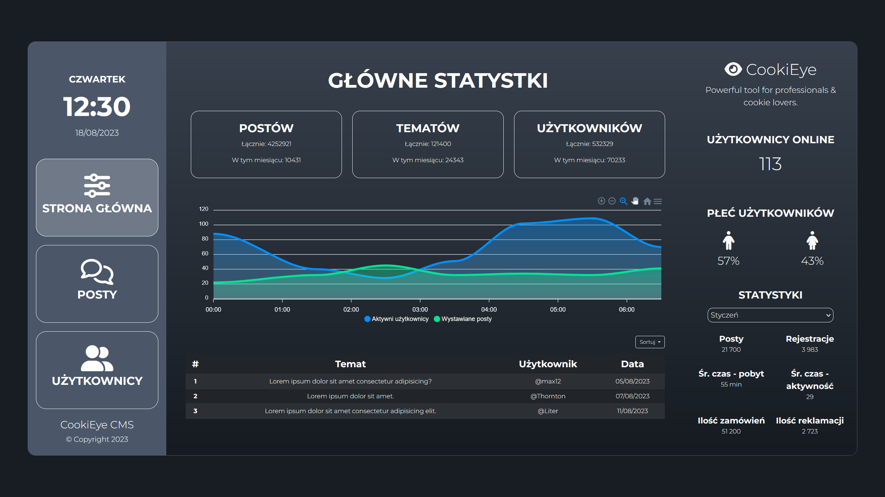
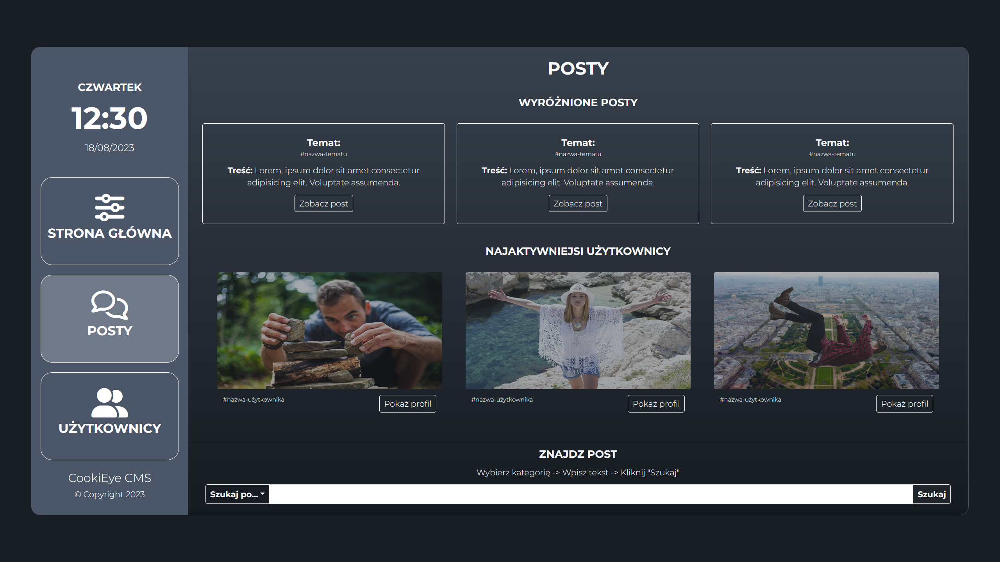
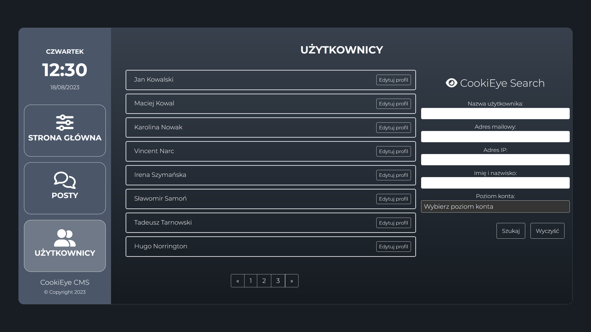
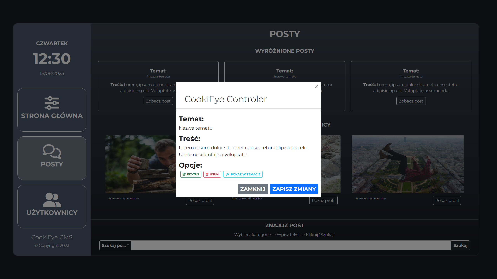
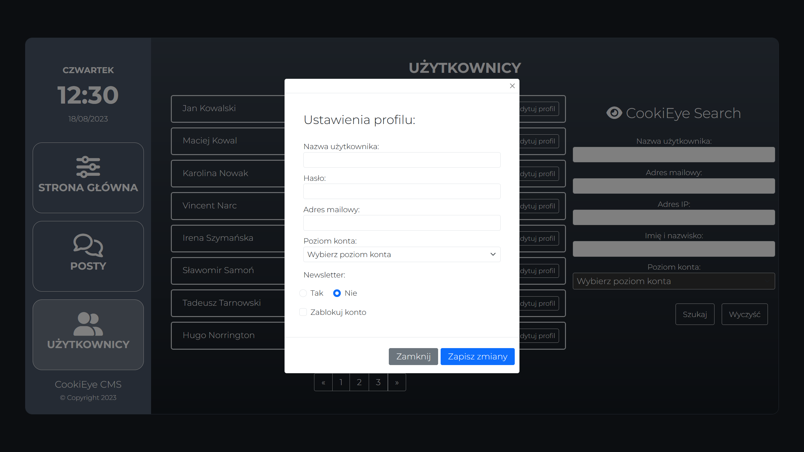

# CookiEye Statistics App

## Screenshots

    </img>
     
    </img>
     
    </img>
     
    </img>
     
    </img>

## Description

- (hypothetical) CMS app to control social media website service.
- App contains 3 subpages: Main, Posts, Users.
- Left panel does not change, because it's navigation.
- App contains Modals that popup when some buttons are clicked.

#### Technology used:
- HTML, CSS, JS
- SCSS
- **Framework:** Bootstrap
- Extra Library: Apex Charts

## What I Learned

- Creating desktop app frontend for CMS
- Using SCSS in a bigger project with many classes.
- Using **rows** and **columns** in Bootstrap.
- Creating sections with Bootstrap and style them.
- Import other libraries (Apex Charts), and using only documentation to learn how to use it.

## Author info

- **Name:** Filip Bereszyński
- **Age:** 21 years old
- **Contact:**
    - bereszynski.filip@gmail.com
    - (+48) 510 240 074